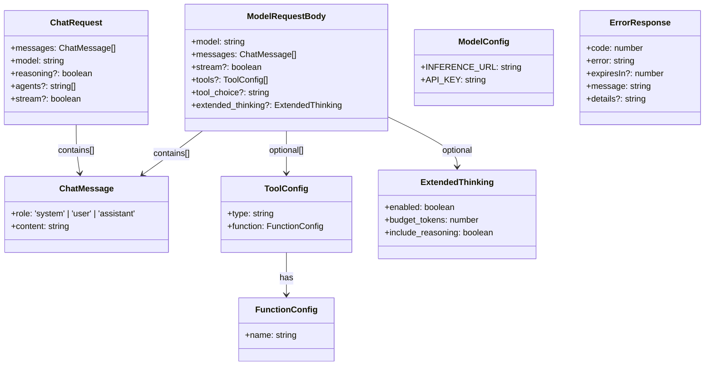
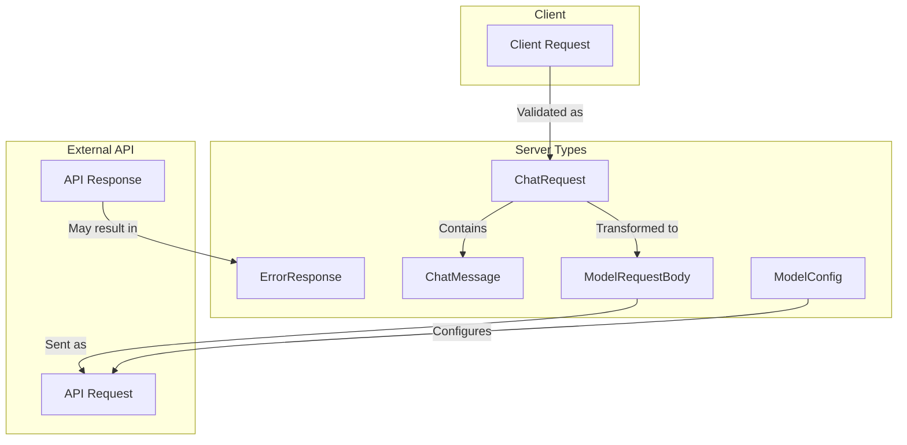

# Type Relationships

This document outlines the relationships between different TypeScript interfaces and types in the
application.

## Server Types Diagram

## Type Usage Flow

## Type Descriptions

1. **ChatMessage**

   - Basic message unit containing role and content
   - Used in both client requests and model interactions

2. **ChatRequest**

   - Primary interface for client-server communication
   - Contains array of messages and configuration options

3. **ModelRequestBody**

   - Internal type for API requests to the model
   - Extends ChatRequest with additional model-specific options

4. **ModelConfig**

   - Configuration interface for model endpoints
   - Contains API credentials and URLs

5. **ErrorResponse**
   - Standardized error response format
   - Used across all API endpoints

## Usage in Routes

The types are primarily used in the chat route (`/api/chat`):

- Request body is validated against `ChatRequest`
- Transformed into `ModelRequestBody` for API calls
- Errors are formatted using `ErrorResponse`
- Model configuration is managed via `ModelConfig`
